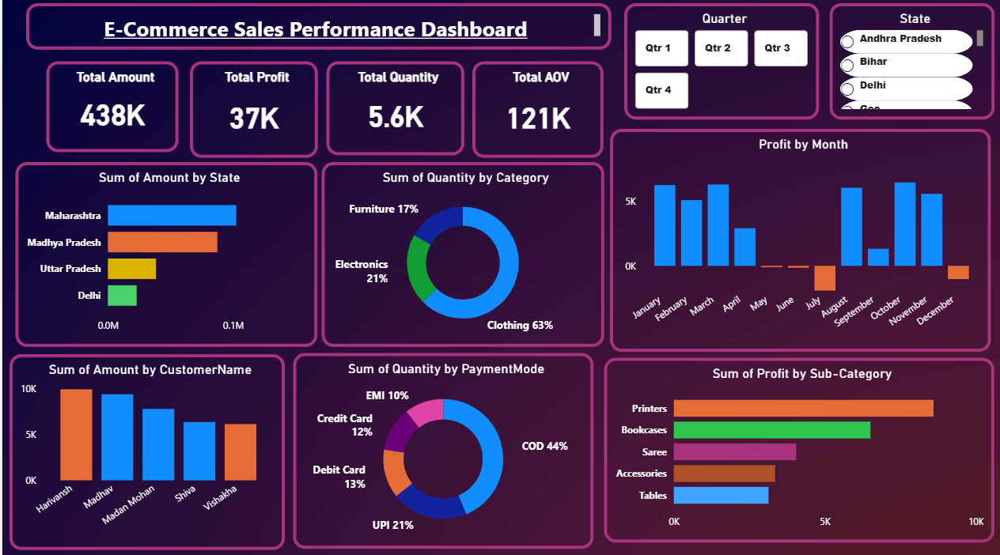

# E-Commerce Sales Performance Dashboard (Power BI)

Most dashboards answer "What happened?" This one is built to answer "Where should I look next?"

An interactive Power BI dashboard that turns raw e-commerce transactional data into a decision-ready view — surfacing sales performance, profitability, and payment behavior across states, categories, and time.



## 📊 Overview

The dashboard covers:

- **Sales KPIs** — Total Sales, Profit, Quantity Sold, and Average Order Value (AOV)
- **Monthly Profit Trends** — tracking seasonality across the year, including a clear mid-year dip
- **Sales Performance by State** — regional breakdown of revenue
- **Category & Sub-Category Analysis** — Clothing drives 63% of quantity sold, ahead of Electronics and Furniture
- **Payment Mode Distribution** — COD leads at 44%, followed by UPI, Debit Card, Credit Card, and EMI
- **Top Customers by Sales** — highest-value customers by total amount
- **Interactive Filtering** — dynamic Quarter and State slicers for on-the-fly analysis

## 🛠️ Tools & Skills Used

- Microsoft Power BI
- Power Query (data cleaning & transformation)
- Data Modeling
- DAX Measures
- Interactive Dashboard Design
- Data Visualization

## 💡 Key Takeaway

A dashboard isn't just about charts — it's about helping decision-makers spot trends, compare performance, and find opportunities faster. This project focused on building a report that a sales or operations team could open and act on immediately, not just a collection of visuals.

## 📁 Project Structure

```
ecommerce-sales-performance-dashboard/
│
├── images/
│   └── dashboard.png          # Dashboard screenshot
├── E-Commerce_Sales_Dashboard.pbix   # Power BI report file
└── README.md
```

## 🔗 Connect

- **Kaggle:** [zohairbaloch](https://www.kaggle.com/zohairbaloch)
- **LinkedIn:** [zohair-baloch-data-analyst](https://www.linkedin.com/in/zohair-baloch-data-analyst)
- **Email:** zohairbaloch.7164@gmail.com

---

⭐ If you found this project useful or interesting, consider giving it a star!
